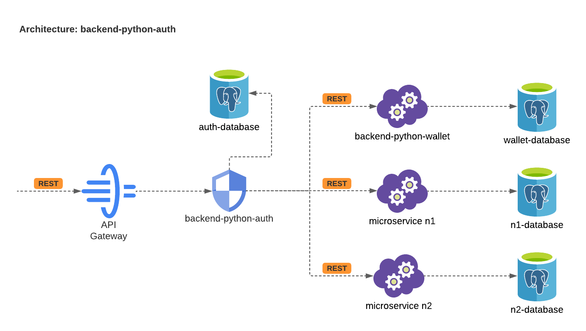

# backend-python-auth
### Objetivo
Autenticar todos os usuários que desejam acessar um microsserviço dentro do escopo do maistodos.

### Arquitetura
Esse serviço foi desenvolvido baseado em uma arquitetura de microsserviços e um design de software focado em Clean Architecture.


### Motivação
Motivação: Em um cenário competitivo onde a mudança é cada vez maior, software difícil de mudar é uma fraqueza estratégica para o negócio. Visto o cenário atual, todas as escolhas para o desenho dessa solução foram pautadas em construir um software com baixo nível de acoplamento, fácil manutabilidade, robustez e simplicidade.

### Estrutura
Toda a estrutura do projeto foi desenvolvida visando garantir separar tecnologias externas como por exemplo frameworks, banco de dados etc. das camadas de application e domínio onde estão as regras de negócio, validações, entidades, exceptions e etc. Consequentemente isso traz o benefício de conseguirmos alterar camadas mais externas ao domínio e application com mínimo de empenho.
```
backend-python-auth
├─ README.md
├─ auth_service
│  ├─ application
│  │  └─ user
│  │     ├─ user_dto.py
│  │     └─ user_services.py
│  ├─ domain
│  │  └─ user
│  │     ├─ entities.py
│  │     ├─ enums.py
│  │     └─ exceptions.py
│  └─ tests
│     ├─ mocks
│     │  └─ user_services_mocks.py
│     └─ tests_user_services.py
├─ backend-python-auth.png
├─ docker-compose.yml
├─ infrastructure
│  └─ wallet
│     ├─ .env
│     ├─ api
│     │  ├─ api.py
│     │  ├─ models
│     │  │  ├─ db.py
│     │  │  └─ users.py
│     │  └─ repositories
│     │     └─ users.py
│     └─ requirements.txt
└─ initial_tables_auth.sql
```
### Camadas Externas (tecnologias)
#### Banco de dados: `PostgreSQL`
##### Motivação:
* Suporta nativamente o JSON e outras funcionalidades NOSQL.
* Performance

#### Framework: `Flask`
##### Motivação:
* Simplicidade.
* Facilidade de aplicar os conceitos do Clean Architecture e alguns Design Patterns.
* Agilidade no desenvolvimento da aplicação.

### Camadas Internas (Regras de negócio, validação, testes etc)
As camadas internas estão dentro da pasta `auth_service`

#### Testes
Para desenvolver os testes foi usado o `unittest` e para executar os mesmos basta entrar no diretório de testes e executar o seguinte comando:
```sh
python -m unittest
```

##### Motivação:
* Simplicidade.
* Nativo do python

### Instalação
Na Raiz do projeto existe um arquivo `docker-compose.yaml`, este contém todos os recursos necessários para rodar localmente a aplicação, incluindo um script sql para criação das tabelas e inserção dos dados iniciais necessários para o desenvolvimento do projeto.
Obs: `certifique-se de ter o docker e o docker-compose instalado`
Na raiz do projeto digite o seguinte comando:
```sh
docker-compose up -d
```
`IMPORTANTE: Em um cenário real eu não subiria o arquivo .env no git, só subi para facilitar a vida de quem vai testar este software e os dados nele contido são fictícios, em um ambiente produtivo eu usaria o secretManager da aws para armazenar os dados sensíveis.`

